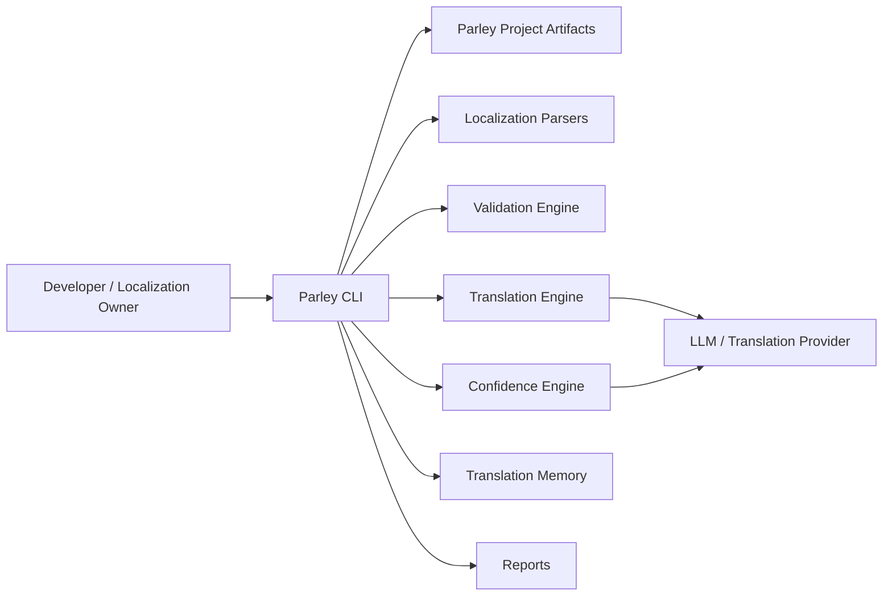
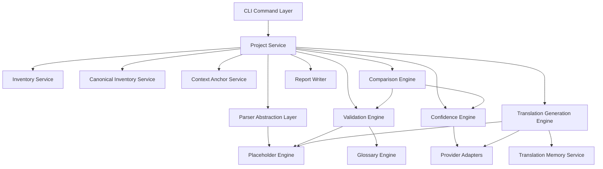
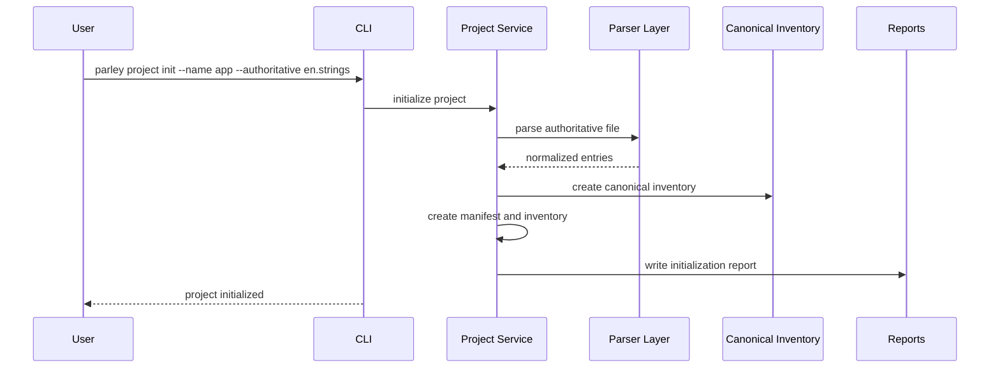

# Parley High-Level Design Architecture

## 1. Purpose

Parley is a CLI-based localization and translation management tool for translating, validating, comparing, and maintaining localization artifacts across a structured project lifecycle.

The primary design goal is to preserve contextual translation quality over time. Parley's MVP workflow is project-oriented: a project captures the authoritative localization, context anchors, localization inventory, canonical key inventory, glossary rules, translation memory, validation reports, and confidence metadata needed to make localization repeatable and semantically consistent. Direct file-to-file translation is a post-MVP convenience workflow.

## 2. Design Principles

- **Project-first workflow:** MVP translation and write-back require project mode because it preserves context, history, and quality signals. Direct two-file translation is deferred until after the MVP.
- **Format-neutral core:** File formats are parsed through adapters into a normalized localization model before validation, comparison, translation, or reporting.
- **Authoritative semantic baseline:** One localization file in each project is the authoritative source for keys, meaning, and downstream translation quality.
- **Context as a durable artifact:** Project-level and per-string context are stored, versioned, reviewed, and reused instead of regenerated on every run.
- **Incremental by default:** Parley should avoid unnecessary retranslations, revalidation, API calls, and human review when inputs have not materially changed.
- **Validation categories are explicit:** Findings use stable categories (e.g., `structural`, `parser_syntax`, `localization_syntax`, `placeholder_integrity`, `terminology`, `spelling`, `grammar`, `clarity`, `semantic`, `artifact_schema`, `io`, `provider`) so CI and humans can gate behavior without ambiguity.
- **Human confirmation is first-class:** Machine-generated confidence and context are useful, but human-reviewed and human-approved artifacts carry stronger authority.

## 3. Recommended Tech Stack

### 3.1 Runtime and Language

Parley should be implemented in **Python 3.12+**.

Rationale:

- Strong CLI ecosystem.
- Good native support for JSON, XML, file traversal, dataclasses, typing, and packaging.
- Mature localization-adjacent libraries.
- Easy integration with LLM APIs and validation services.
- Low operational friction for a developer tool distributed as a CLI.

### 3.2 CLI Framework

Use **Typer** for command definition and **Rich** for terminal output.

- `typer`: command groups, typed arguments, help output, shell completion.
- `rich`: tables, progress indicators, colored validation reports, readable diffs.

### 3.3 Data Modeling and Validation

Use **Pydantic v2** for internal schemas and persisted artifact validation.

Recommended model families:

- Project configuration.
- Localization inventory.
- Canonical string inventory.
- Normalized localization entries.
- Context anchors.
- Confidence reports.
- Validation reports.
- Glossary rules.
- Translation memory records.

### 3.4 Artifact Formats

Use **YAML** for human-authored project configuration and glossary files, and **JSON Lines** or **SQLite** for larger machine-managed stores.

Recommended defaults:

- Project manifest: `parley.yaml`.
- Localization inventory: `inventory.yaml`.
- Context anchor: `context-anchor.yaml`.
- Glossary: `glossary.yaml`.
- Canonical inventory: `canonical-inventory.json`.
- Reports: `reports/*.json` plus optional terminal/table summaries.
- Translation memory: SQLite for non-trivial projects, with JSON export/import support.

YAML is easier for humans to review and edit. JSON is better for deterministic machine output. SQLite is a good default for translation memory because it supports indexed lookup, incremental updates, provenance, and confidence metadata without requiring an external service.

### 3.5 Parsing Libraries

Initial parsers:

- iOS `.strings`: use a dedicated parser if available, or implement a small parser that preserves comments, escaped strings, and duplicate-key diagnostics.
- Android XML resources: use `lxml` or Python standard `xml.etree.ElementTree`; prefer `lxml` if comment preservation and richer diagnostics are needed.

Future parsers should implement the same parser interface and emit the same normalized representation.

### 3.6 LLM and Translation Provider Layer

Implement translation and semantic analysis behind provider interfaces.

Initial providers:

- OpenAI-compatible LLM provider for context generation, translation, confidence analysis, semantic comparison, and quality rationale.
- Optional deterministic local validators for placeholders, structure, terminology (glossary), spelling, and syntax.

Provider-facing code should be isolated from business workflows so Parley can later support other model providers, offline translation engines, or enterprise gateways.

### 3.7 Testing and Quality

Use:

- `pytest` for unit and integration tests.
- `ruff` for linting and formatting.
- `mypy` or `pyright` for static type checking.
- Golden-file tests for parser behavior and report formats.
- Snapshot-style tests for CLI output where useful.

## 4. System Context

Parley runs as a local CLI against files in a developer workspace or CI environment.



External services should be optional at command level. Structural validation, placeholder validation, inventory comparison, terminology (glossary) checks, and canonical drift detection should run locally. Translation generation, semantic comparison, contextual confidence, and grammar/clarity analysis may require an LLM or language service.

Architecturally, **Project Service** is the workflow orchestration boundary: it validates project artifacts and preconditions first, then invokes local parsing/validation/comparison logic, and only then invokes provider-backed operations when a command explicitly enables or requires them. Reports are written deterministically from structured outputs (stable ordering, stable identifiers) so CI and humans can reliably compare runs.

## 5. Project Layout

Recommended project artifact layout:

```text
<project-root>/
  parley.yaml
  inventory.yaml
  canonical-inventory.json
  context-anchor.yaml
  glossary.yaml
  translation-memory.sqlite
  localizations/
    authoritative/
    targets/
  reports/
    confidence/
    validation/
    comparison/
  .parley/
    cache/
    locks/
    run-history/
```

Parley should not require localization files to live inside `localizations/`, but the inventory should reference every managed file with a stable ID, path, locale, format, role, and status.

## 6. Core Domain Model

### 6.1 Normalized Localization Entry

Every parser should convert file-specific strings into a normalized entry:

```text
LocalizationEntry
  key: string
  value: string
  locale: string
  format: string
  source_path: string
  metadata: map
  context_metadata: optional ContextMetadata
  validation_metadata: optional ValidationMetadata
  placeholders: list PlaceholderToken
  content_hash: string
```

The `content_hash` should be calculated from the key, value, placeholders, and relevant parser metadata. It enables incremental change detection.

### 6.2 Project Manifest

The project manifest defines:

- Project name.
- Project ID.
- Project description.
- Authoritative localization file ID.
- Authoritative source language.
- Artifact version.
- Default provider settings.
- Validation policy references.

### 6.3 Localization Inventory

The inventory defines all managed localization files:

- Stable localization ID.
- Locale.
- Format.
- Relative path.
- Role: `authoritative` or `target`.
- Parser adapter.
- Last observed content hash.
- Human status, such as `draft`, `reviewed`, `approved`, or `locked`.

### 6.4 Canonical String Inventory

The canonical inventory is derived from the authoritative localization and acts as the structural baseline.

It stores:

- Canonical keys.
- Authoritative values.
- Placeholder signatures.
- Content hashes.
- Optional grouping or namespace metadata.
- First-seen and last-updated timestamps.

### 6.5 Context Anchor

The context anchor stores semantic context:

- Project-level description.
- Functional domain.
- Important localization considerations.
- Authoritative source language.
- Per-key context descriptions.
- Confidence dimensions.
- Human confirmation state.
- Notes.

Per-key context should be keyed by canonical localization key.

### 6.6 Translation Memory

Translation memory stores reusable translation records:

- Source key.
- Source locale.
- Target locale.
- Source text.
- Translated text.
- Placeholder signature.
- Context anchor reference.
- Glossary version reference.
- Provenance: machine-generated, human-reviewed, human-approved, or imported.
- Confidence dimensions.
- Approval status.
- Content hashes.
- Creation and update timestamps.

Approved translations should outrank generated translations during reuse decisions.

## 7. High-Level Components



The critical contract boundary for MVP is: **CLI → Project Service**. The Project Service owns precondition checks (artifact schema validation, required artifact presence) and enforces a consistent ordering policy:

- Validate required project artifacts and inputs before any provider calls.
- Emit reports in a deterministic order (stable sorting of keys/findings) and with stable run identifiers.
- Resolve and lock the project report root early (including `run_id`) so report placement is deterministic and does not overwrite by default.
- Treat provider-backed work as explicitly enabled/required per command; when optional and disabled/unavailable, emit a report indicating provider-skipped rather than silently omitting output.

### 7.1 CLI Command Layer

Responsible for:

- Command parsing.
- User-facing output.
- Exit codes.
- Report path display.
- Confirmation prompts where appropriate.

Suggested command groups:

- `parley project init`
- `parley localization add`
- `parley localization validate`
- `parley localization compare`
- `parley context generate`
- `parley context report`
- `parley translate`
- `parley glossary validate`
- `parley memory inspect`

### 7.2 Parser Abstraction Layer

Responsibilities:

- Detect or accept localization format.
- Parse localization files into normalized entries.
- Preserve key/value structure.
- Extract comments and metadata where available.
- Extract placeholder tokens.
- Emit parser diagnostics.
- Serialize normalized entries back into the target format when translation updates are written.

Interface shape:

```text
LocalizationParser
  supports(path, declared_format) -> bool
  parse(path) -> ParsedLocalizationFile
  write(path, parsed_file, updated_entries) -> WriteResult
```

Initial adapters:

- `IosStringsParser`
- `AndroidXmlResourcesParser`

### 7.3 Project Service

Coordinates project-level workflows:

- Load and validate project artifacts.
- Resolve paths.
- Enforce authoritative localization rules.
- Coordinate inventory, canonical inventory, context, validation, confidence, and translation services.
- Maintain run history and cache metadata.

### 7.4 Inventory Service

Responsibilities:

- Add localization files.
- Update known file metadata.
- Track locale, format, role, and status.
- Detect moved or missing files.
- Provide the file collection for validation and comparison.

### 7.5 Canonical Inventory Service

Responsibilities:

- Generate canonical key inventory from the authoritative localization.
- Detect added, removed, or modified authoritative keys.
- Track placeholder signatures for each canonical key.
- Identify downstream files affected by authoritative changes.

### 7.6 Context Anchor Service

Responsibilities:

- Generate standalone context proposals.
- Store project-level and per-string context.
- Track confidence dimensions.
- Track human confirmation status.
- Support updates from reports or reviewed context proposals.

### 7.7 Confidence Engine

Responsibilities:

- Generate confidence reports relative to an existing context anchor.
- Generate standalone context confidence reports without an anchor.
- Produce per-entry confidence dimensions.
- Produce aggregate summaries.
- Include rationale and notes where useful.
- Preserve whether assessments are machine-generated or human-confirmed.

Confidence dimensions:

- `semantic`
- `contextual`
- `grammatical`
- `terminology_compliance`
- `placeholder_integrity`
- `clarity`

### 7.8 Validation Engine

Responsibilities:

- Run structural validation.
- Run syntax validation.
- Run spelling and grammar checks where provider support exists.
- Run clarity checks.
- Run terminology (glossary) checks.
- Run placeholder integrity checks.
- Classify each finding by category, severity, key, locale, file, and suggested remediation.

Validation categories must remain distinct so CI and humans can decide which classes of issues are blocking.

Exact category and severity enums are owned by the **Validation and Error Taxonomy Specification**; this HLD only defines workflow boundaries and component responsibilities.

### 7.9 Placeholder Engine

Responsibilities:

- Extract placeholders and tokens from source and target strings.
- Normalize placeholder signatures.
- Detect missing, malformed, reordered, translated, or type-mismatched placeholders.
- Protect placeholders during translation prompts and post-processing.

Supported placeholder classes:

- Interpolation variables, such as `{name}`.
- Formatting tokens, such as `%d` and `%@`.
- Templating expressions, such as `{{amount}}`.
- ICU message syntax.
- Positional placeholders.
- Embedded markup fragments, such as `<b>Continue</b>`.

### 7.10 Glossary Engine

Responsibilities:

- Load and validate the human-authored project glossary rules (`glossary.yaml`).
- Apply preferred, prohibited, protected, untranslated, and canonical terminology rules.
- Provide terminology hints during translation generation.
- Emit terminology violations as a distinct validation category (`terminology`).

If `glossary.yaml` is absent, the Glossary Engine should behave as if an empty ruleset is present.

For determinism, glossary application should be stable and documented (rule evaluation and precedence should not depend on input ordering). Exact rule schema and precedence are owned by the leaf specs; the HLD only requires the behavior to be deterministic.

### 7.11 Translation Memory Service

Responsibilities:

- Store generated, reviewed, and approved translations.
- Retrieve candidate translations by locale pair, source text hash, key, context, glossary version, and placeholder signature.
- Score reuse candidates.
- Prefer human-approved translations.
- Support import/export for portability.

### 7.12 Translation Generation Engine

Responsibilities:

- Require a context anchor for project-mode generation.
- Use authoritative localization as the semantic baseline.
- Consult translation memory before calling a translation provider.
- Apply glossary constraints.
- Protect and validate placeholders.
- Support incremental translation.
- Write translated entries back through parser adapters.
- Record provenance and confidence metadata.

### 7.13 Comparison Engine

Responsibilities:

- Compare two or more localization files structurally.
- Compare two localization files semantically without using the project context anchor.
- Compare project files against authoritative localization.
- Detect meaning drift, contextual inconsistencies, translation anomalies, and semantic divergence.

### 7.14 Report Writer

Responsibilities:

- Write machine-readable reports.
- Render human-readable terminal summaries.
- Provide stable schemas for CI consumption.
- Include aggregate and per-entry details.

### 7.15 Artifact Authority Map

This table defines the authoritative producer and mutation boundary for MVP artifacts. Detailed schemas are owned by the referenced leaf specs.

| Artifact / Family | Authoritative producer | Allowed mutators | Primary consumers | Persistence location | Leaf-spec owner (detailed contracts) |
| --- | --- | --- | --- | --- | --- |
| `parley.yaml` (project manifest) | Project Service (via CLI) | Project Service | All services via Project Service; CLI | `<project-root>/parley.yaml` | Project Artifact Schema Specification |
| `inventory.yaml` (localization inventory) | Inventory Service | Inventory Service | Project Service; CLI; Validation/Compare/Translate workflows | `<project-root>/inventory.yaml` | Project Artifact Schema Specification |
| `canonical-inventory.json` (canonical keys baseline) | Canonical Inventory Service | Canonical Inventory Service | Inventory/Validation/Comparison/Translation workflows | `<project-root>/canonical-inventory.json` | Project Artifact Schema Specification |
| `context-anchor.yaml` (project + per-key context) | Context Anchor Service | Context Anchor Service; human review flow (via CLI) | Confidence Engine; Translation Generation Engine; humans | `<project-root>/context-anchor.yaml` | Project Artifact Schema Specification + Confidence Model Specification |
| `glossary.yaml` (terminology rules) | Humans (authoring workflow) | Humans (via editor or explicit `parley glossary` commands) | Validation Engine; Translation Generation Engine; Confidence Engine (terminology dimension) | `<project-root>/glossary.yaml` | Project Artifact Schema Specification + Validation and Error Taxonomy Specification |
| Translation memory store | Translation Memory Service | Translation Memory Service; human approval workflow (via CLI) | Translation Generation Engine; CLI inspection | `<project-root>/translation-memory.sqlite` | Translation Memory Specification |
| Reports (`reports/**/*.json`) | Report Writer (invoked by Project Service) | Report Writer | Humans; CI; downstream tooling | `<project-root>/reports/` | Project Artifact Schema Specification + Validation and Error Taxonomy Specification |
| Run history + cache metadata | Project Service | Project Service | CLI; debugging; incremental decisions | `<project-root>/.parley/run-history/` and `<project-root>/.parley/cache/` | CLI Command Specification (behavior) + Project Artifact Schema Specification (if persisted shape is standardized) |
| Cache/locks | Project Service | Project Service | Project Service | `<project-root>/.parley/cache/` and `<project-root>/.parley/locks/` | CLI Command Specification (behavior) |
| Localization file write-back | Parser Abstraction Layer (write) coordinated by Project Service | Parser Abstraction Layer (write), under Project Service | User workspace; subsequent workflows | Referenced in `inventory.yaml` | Parser Interface and Format Specification |

Implementation note for determinism: MVP reports are project-scoped outputs under `<project-root>/reports/` and should be treated as run-scoped outputs (identified by a run id, timestamp, and command). They should not silently overwrite prior outputs unless explicitly requested by a CLI flag. Exact naming, folder layout, and overwrite behavior are owned by the leaf specs.

## 8. Key Workflows

### 8.1 Project Initialization



Initialization creates:

- Project manifest.
- Localization inventory.
- Canonical string inventory.
- Initial authoritative localization record.
- Schema-valid empty `context-anchor.yaml` placeholder (no provider calls).

Terminal outputs:

- Project artifacts: `parley.yaml`, `inventory.yaml`, `canonical-inventory.json`, `context-anchor.yaml`.
- Initialization report under `reports/`.

Obvious failure categories:

- Parser/IO failure reading the authoritative file.
- Write failure creating project artifacts or the initialization report.

### 8.2 Add Existing Localization File

Flow:

1. Parse the file through the parser abstraction layer.
2. Add or update the inventory record.
3. Compare keys against canonical inventory.
4. Run placeholder validation against authoritative entries.
5. Run localization validation/error checks.
6. Generate contextual confidence report (provider-optional; see decision rules below).
7. Write validation and confidence reports.

Confidence mode decision rules:

- If `context-anchor.yaml` is missing: treat as “no anchor” and use **Standalone Context Confidence Report** behavior (8.3) only if provider access is explicitly enabled; otherwise write a confidence report indicating provider-skipped / no-confidence-generated.
- If `context-anchor.yaml` exists but fails schema validation: fail fast as an artifact schema error (no provider calls) and do not attempt confidence generation.
- If `context-anchor.yaml` exists and is schema-valid but effectively empty/unpopulated (the placeholder written by `parley project init`): treat as “no anchor” for confidence purposes and follow the same behavior as the missing-anchor case.
- If `context-anchor.yaml` exists, is schema-valid, and contains populated per-key context: use **Relative-to-Anchor Confidence Report** behavior (8.4).

Ordering guarantees:

- Steps 1–5 run before any provider-backed confidence work.
- If confidence generation is provider-optional and provider access is not enabled or provider is unavailable, the workflow still writes a confidence report that explicitly records provider-skipped.

Missing keys and extra keys are structural validation findings.

Terminal outputs:

- Updated `inventory.yaml` record for the file.
- Validation report under `reports/validation/`.
- Confidence report under `reports/confidence/` (or provider-skipped confidence report, per decision rules).

Obvious failure categories:

- Parser/IO failure reading the localization file.
- Artifact schema invalid for required project artifacts (inventory/canonical/context anchor).
- Provider required/unavailable (only if confidence is enabled and a provider is needed).

### 8.3 Standalone Context Confidence Report

Used when no context anchor exists.

Output per entry:

- Confidence dimensions.
- Aggregate confidence.
- Proposed context description.
- Optional notes.
- Machine-generated assessment marker.

This report can be promoted into a context anchor after human review.

Terminal outputs:

- Standalone confidence report under `reports/confidence/`.

Obvious failure categories:

- Provider required/unavailable (when provider-backed confidence generation is enabled).
- Provider failure during confidence generation.

### 8.4 Relative-to-Anchor Confidence Report

Used when a context anchor already exists.

Output per entry:

- Confidence dimensions.
- Aggregate confidence.
- Rationale and notes where applicable.

No contextual rewrite is required because the report evaluates against existing context.

Terminal outputs:

- Relative-to-anchor confidence report under `reports/confidence/`.

Obvious failure categories:

- Artifact schema invalid for `context-anchor.yaml`.
- Provider required/unavailable (when provider-backed confidence generation is enabled).

### 8.5 Context-Aware Translation Generation

Flow:

1. Load project manifest, inventory, canonical inventory, context anchor, translation memory, and glossary (if present).
2. Parse authoritative and target files.
3. Detect changed, new, stale, locked, approved, and high-confidence entries.
4. Reuse approved translation memory entries when appropriate.
5. Generate translations only for affected entries.
6. Enforce glossary constraints.
7. Validate placeholder integrity.
8. Write target localization through the parser adapter.
9. Update translation memory and reports.

Project-mode translation requires `context-anchor.yaml` to exist and validate. For MVP, `parley project init` writes a schema-valid empty anchor (no provider calls), while `parley context generate` (or an equivalent review/import flow) is responsible for populating it.

A schema-valid but effectively empty/unpopulated anchor (the placeholder written by `parley project init`) is not sufficient for context-aware translation: treat it as a precondition failure and fail fast before any provider calls. If the context anchor is missing, invalid, or unpopulated, translation should fail fast before any provider calls.

Ordering guarantees:

- All artifact schema validation and precondition checks complete before any provider-backed translation generation.
- Placeholder integrity validation is a write-back gate: blocking placeholder findings prevent writing translated output.

Terminal outputs:

- Updated target localization file(s) written via parser adapters.
- Translation report under `reports/` (and any validation findings produced during translation).
- Updated translation memory store.

Obvious failure categories:

- Artifact schema invalid or precondition failure for `context-anchor.yaml`.
- Provider required/unavailable (for translation generation).
- Blocking validation findings (e.g., placeholder integrity failures) preventing write-back.
- Write-back failure writing updated localization files.

### 8.6 Paired File Translation

Paired-file translation is deferred and is not part of the MVP architecture target.

Reason: direct source-to-target translation without a project introduces separate report-root rules, overwrite behavior, provider behavior without durable context, write-back safety, and translation-memory continuity questions. Those choices are real, but they should not shape the first useful project-first MVP.

Post-MVP paired translation may support:

- Parsing both files.
- Comparing structure.
- Generating or updating target entries.
- Validating placeholders.
- Writing the target localization file through the parser adapter.
- Producing translation and confidence comparison reports under an explicitly defined non-project report root.

For MVP, translation and write-back workflows require a project root and write reports under `<project-root>/reports/`.

### 8.7 Structural Comparison

Structural comparison determines:

- Whether all compared files contain identical keys.
- Which keys are missing in each file.
- Which keys are extra in each file.
- Whether placeholder signatures differ.

Terminal outputs:

- Structural comparison report under `reports/comparison/`.

Obvious failure categories:

- Parser/IO failure reading one or more compared files.

### 8.8 Semantic Comparison

Semantic comparison identifies:

- Meaning drift.
- Contextual inconsistency.
- Translation quality anomalies.
- Semantic divergence from the authoritative baseline.

Post-MVP paired-file semantic comparison should not use the project context anchor; it is based strictly on cross-comparison between files. MVP semantic comparison is project-scoped.

Terminal outputs:

- Semantic comparison report under `reports/comparison/`.

Obvious failure categories:

- Provider required/unavailable (when semantic comparison is provider-backed).
- Provider failure during semantic comparison.

## 9. Incremental Change Detection

Parley should maintain hashes for:

- Authoritative key/value pairs.
- Target key/value pairs.
- Placeholder signatures.
- Context-anchor entries.
- Glossary versions.
- Translation memory entries.

Incremental translation should skip:

- Unchanged strings.
- Locked translations.
- Human-approved translations.
- Sufficiently high-confidence translations.

It should flag:

- Newly added localization keys.
- Modified authoritative strings.
- Invalidated translations.
- Stale downstream translations.
- Placeholder signature changes.
- Glossary changes that may invalidate existing translations.

## 10. Report Model

Reports should be written as versioned JSON documents with optional terminal summaries.

Minimum report families for MVP (exact schemas owned by leaf specs):

- Initialization reports (project init).
- Validation reports.
- Confidence reports (standalone and relative-to-anchor).
- Translation reports.
- Comparison reports (structural and semantic).

Common fields:

- Schema version (`schema_version`; v1: `"1.0"`).
- Report type (family + subtype).
- Project ID.
- Command/run ID (`run_id`).
- Timestamp.
- Input files.
- Provider metadata where applicable.
- Provider status when provider work is optional (e.g., used vs skipped/unavailable).
- Findings.
- Aggregate summaries.

Finding fields:

- Category.
- Severity.
- Locale.
- File path.
- Localization key.
- Message.
- Rationale.
- Suggested fix.
- Machine or human origin.

For determinism, reports should use stable sorting of findings (for example by severity, then category, then locale, then key) and should avoid nondeterministic ordering derived from filesystem iteration.

Report location anchoring rule:

- For MVP, report roots are anchored at `<project-root>/reports/`.
- Report writes are run-scoped under the project report root (for example `<project-root>/reports/<family>/<run_id>/...`) so artifacts do not silently overwrite prior runs.
- Non-project report roots, including paired-file translation report placement, are deferred until paired-file translation is brought into scope after the MVP.

Recommended severities:

- `info`
- `warning`
- `error`
- `blocking`

Exact finding shape, category enum, and severity enum are owned by the **Validation and Error Taxonomy Specification**, and the report document schema is owned by the **Project Artifact Schema Specification**.

## 11. Reliability, CI, and Exit Codes

Parley should be useful both interactively and in CI.

Suggested exit behavior:

- `0`: command succeeded with no blocking findings.
- `1`: validation completed with blocking findings.
- `2`: usage, configuration, or artifact schema error.
- `3`: parser or file IO failure.
- `4`: required provider operation failed.

Commands should support output paths and machine-readable report modes so CI can consume results without scraping terminal output.

## 12. Security and Privacy

Because localization files may contain product names, unreleased features, user-facing legal text, or internal domain language, provider access should be explicit and configurable.

Recommendations:

- Do not send files to external providers unless the command requires semantic or translation services.
- Show or log which provider is used.
- Avoid storing raw provider prompts in normal logs by default.
- Support local-only validation commands.
- Keep API keys in environment variables or OS credential stores, not project manifests.
- Provide redaction hooks for sensitive strings if needed.

## 13. Extensibility

Parley should define plugin-like boundaries for:

- Localization parsers.
- Placeholder token detectors.
- Translation providers.
- Confidence providers.
- Validation providers.
- Report renderers.

The first implementation does not need dynamic third-party plugin loading. It should still keep interfaces clean so additional formats and providers can be added without rewriting workflows.

## 14. Supporting Specs Recommendation

Yes, Parley needs additional supporting specs before implementation goes deep. The HLD is enough to align the architecture, but several areas need more precise contracts to prevent ambiguity and rework.

Recommended supporting specs:

1. **CLI Command Specification**
   - Commands, arguments, options, examples, exit codes, and expected artifacts.

2. **Project Artifact Schema Specification**
   - Exact schemas for `parley.yaml`, `inventory.yaml`, `canonical-inventory.json`, `context-anchor.yaml`, `glossary.yaml`, report JSON, and translation memory import/export.

3. **Parser Interface and Format Specification**
   - Parser contract, normalized representation, iOS `.strings` behavior, Android XML behavior, escaping rules, comments, duplicate keys, and write-back guarantees.

4. **Placeholder and Token Integrity Specification**
   - Token grammar, placeholder equivalence rules, ICU handling, markup handling, reorder rules, and validation severity mapping.

5. **Confidence Model Specification**
   - Confidence dimensions, score ranges, aggregation rules, human confirmation states, report schema, and thresholds for translation generation.

6. **Translation Workflow Specification**
   - Prompt construction, provider interface, translation memory lookup order, incremental skip rules, glossary injection, retry behavior, and post-generation validation.

7. **Validation and Error Taxonomy Specification**
   - Canonical categories, severity levels, finding shape, CI policy mapping, and examples.

8. **Translation Memory Specification**
   - Storage schema, lookup strategy, match scoring, provenance model, approval states, and migration/export format.

### 14.1 HLD-to-Leaf Ownership Map

This map identifies where detailed contracts live when the HLD intentionally stays architectural.

| HLD surface | Leaf-spec owner |
| --- | --- |
| CLI commands, flags, prompts, exit codes, CLI-visible behavior | CLI Command Specification |
| Project artifact schemas (`parley.yaml`, `inventory.yaml`, `canonical-inventory.json`, `context-anchor.yaml`, `glossary.yaml`) | Project Artifact Schema Specification |
| Parser interface, normalized model details, format-specific behavior, write-back guarantees | Parser Interface and Format Specification |
| Placeholder extraction, placeholder equivalence, placeholder failure severity mapping | Placeholder and Token Integrity Specification |
| Confidence dimensions, scoring/aggregation, thresholds, context confidence report shape | Confidence Model Specification |
| Translation provider interface, prompt construction, translation memory lookup order, incremental skip rules, glossary injection, retry policy | Translation Workflow Specification |
| Validation categories/severities/enums, finding schema, CI policy mapping, terminology category definition (`terminology`) | Validation and Error Taxonomy Specification |
| Translation memory storage schema, lookup strategy/scoring, provenance and approval model, import/export format | Translation Memory Specification |

My opinion: the first three specs are essential before writing much production code. Placeholder integrity and translation workflow specs should follow immediately after, because mistakes there can corrupt localized output. The confidence model, validation taxonomy, and translation memory specs can evolve alongside the first implementation, but they still need written contracts before the CLI is considered stable.

## 15. Initial Implementation Milestones

1. Build the CLI skeleton, project manifest, inventory, and canonical inventory.
2. Implement parser abstraction with iOS `.strings` and Android XML adapters.
3. Implement structural comparison and placeholder extraction/validation.
4. Add project initialization and localization add workflows.
5. Add report writer and CI-friendly exit codes.
6. Add context-anchor storage and standalone confidence report generation.
7. Add glossary validation.
8. Add translation memory.
9. Add context-aware incremental translation generation.
10. Add semantic comparison workflows.

## 16. MVP Architecture Acceptance Criteria

The HLD is architecturally “done enough” for MVP implementation when the following observable checks hold:

- **Project init artifacts:** `parley project init` produces `parley.yaml`, `inventory.yaml`, `canonical-inventory.json`, and a schema-valid empty `context-anchor.yaml` placeholder, plus an initialization report.
- **Add-localization artifacts:** `parley localization add` (project mode) always emits a validation report, and also emits a confidence report whose mode and provider-skipped behavior follows the rules in 8.2 (no silent ambiguity between standalone vs relative-to-anchor).
- **Authority completeness:** Every artifact family listed in 7.15 has a named authoritative producer, allowed mutators, persistence location, and leaf-spec owner for detailed contracts.
- **Workflow completeness:** Every workflow in section 8 names its terminal outputs (artifacts/reports) and at least one obvious failure category (e.g., parser/IO, artifact schema invalid, provider required/unavailable, blocking validation findings).
- **Project-scoped reports:** MVP report outputs are anchored under `<project-root>/reports/`, are run-scoped by default, and do not silently overwrite prior reports.
- **Deferred paired translation:** Paired-file translation is explicitly marked post-MVP and does not define MVP report-root, overwrite, or write-back requirements.
- **Leaf-spec linkage:** Detailed schema/enums/contracts referenced by the HLD are owned by the appropriate leaf specs in section 14 (the HLD remains architectural and does not expand full report/validation/confidence schemas).
